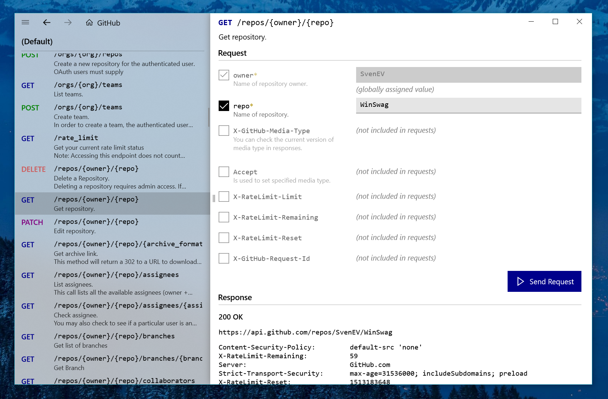

<h1 align="center">
    
    WinSwag
</h1>

<h4 align="center">
    A UWP app for loading Swagger/OpenAPI definitions and exploring REST APIs.
</h4>

    

    

---

WinSwag requires Windows 10 Fall Creators Update.
